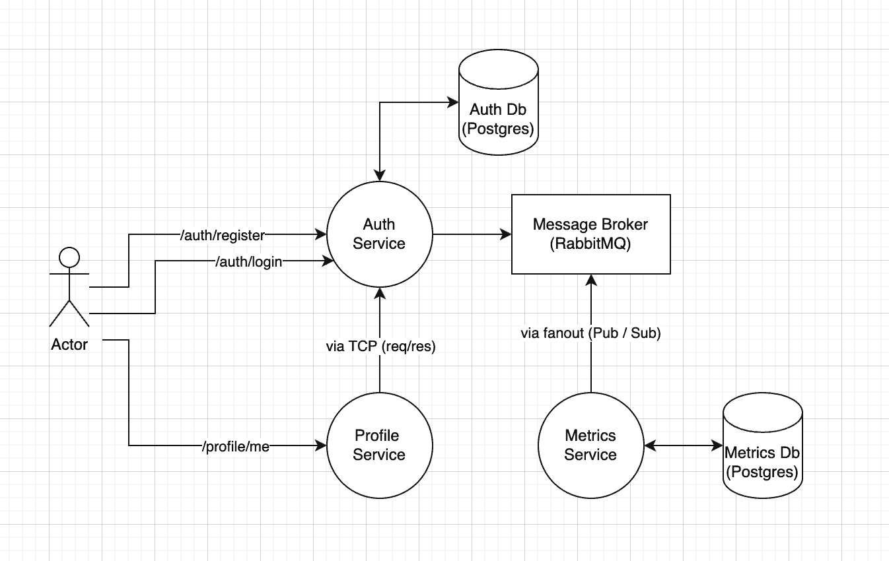

NESTJS MICROSERVICES PROFILE
======

## Description

This is a test project demonstrating a microservices approach built using the [NestJS](https://github.com/nestjs/nest) framework. This project is not intended to be an ideal architecture example or production-ready use case, but rather a playground to experiment with messaging between services.



## Features and details

- [x] Fully dockerized with Docker Compose support
- [x] Microservice based architecture
- [x] Monorepo based structure with common modules extracted out
- [x] Showcases request response based communication (auth and profile microservices)
- [x] Showcases pub sub pattern / fan-out (auth and metric microservices)
- [x] Uses JOI to ensure required env vars are set correctly
- [x] Different log levels based on the environment
- [x] Uses Passport for authentication
- [x] Uses Postgres as database
- [x] Uses Prisma as ORM
- [x] Uses RabbitMQ for messaging
- [ ] Ready for production

## Installation

1- Copy sample env files within each app to non sample versions, and update the keys / tokens / passwords within it, as well as within docker compose

2- Install dependencies (optional)
```bash
# For IDE support (maybe)
$ pnpm i -r
```

## Running the project

```bash
# development
$ docker-compose up --build

# tear down
$ docker-compose down
```

## Try it out

```bash
# Ensure each service returns the success message
$ curl --location 'http://localhost:3010/'
$ curl --location 'http://localhost:3015/'
$ curl --location 'http://localhost:3020/'

# Register user
$ curl --location 'http://localhost:3010/auth/register' \
--header 'Content-Type: application/json' \
--data-raw '{
    "name": "Q",
    "email": "abc@xyz.com",
    "password": "SaMhSHDCJ!23sdyeUggxSD"
}'

# Login user
$ curl --location 'http://localhost:3010/auth/login' \
--header 'Content-Type: application/json' \
--data-raw '{
    "email": "abc@xyz.com",
    "password": "SaMhSHDCJ!23sdyeUggxSD"
}'

# Get current user's profile
$ curl --location 'http://localhost:3015/profile/me' \
--header 'Authorization: Bearer [ACCESS_TOKEN_FROM_LOGIN_RESPONSE]'
```

## Relevant links

- [NestJS Microservies](https://docs.nestjs.com/microservices/basics)
- [Primsa](https://docs.nestjs.com/recipes/prisma)
- [Passport](https://docs.nestjs.com/recipes/passport)
- [RabbitMQ Module](https://www.npmjs.com/package/@golevelup/nestjs-rabbitmq)
- [RabbitMQ Pub/Sub](https://www.rabbitmq.com/tutorials/tutorial-three-javascript)

## License

Nest is [MIT licensed](LICENSE).
